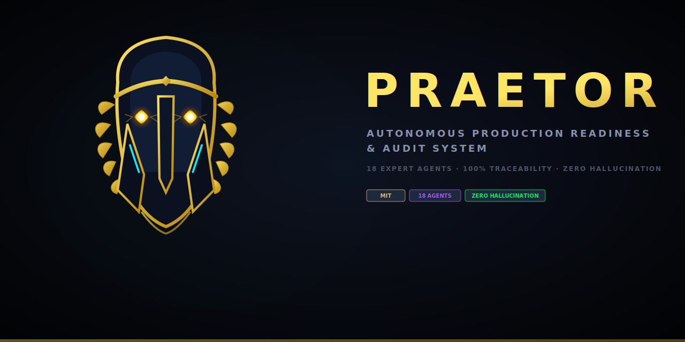

<div align="center">



<br/>

**The autonomous production readiness & audit system for modern engineering teams.**

<br/>

[](https://github.com/moharery/praetor/blob/main/LICENSE)
[](https://github.com/moharery/praetor/pulls)
[](https://github.com/moharery/praetor/releases)
[](#the-18-expert-agents)
[](#-quick-start)

<br/>

[`Quick Start`](#-quick-start) · [`Features`](#-features) · [`Architecture`](#-how-it-works) · [`Agents`](#the-18-expert-agents) · [`Contributing`](#-contributing) · [`License`](#-license)

</div>

---

## What is Praetor?

**Praetor** (Production Readiness, Audit, Evidence, Testing, Operations & Review) is a single-prompt, multi-agent orchestration framework that transforms any codebase into a comprehensive **production readiness audit package**. By dispatching **18 autonomous domain experts** overseen by a **4-Judge Quality Council**, Praetor performs multi-disciplinary audits across security, compliance, performance, accessibility, and operations — with **100% source-code traceability**.

No assumptions. No hallucinations. Just mathematically precise, file-line cited evidence packages for engineering, compliance, operations, and business stakeholders.

> **TL;DR** — You paste one prompt into your LLM. Praetor reads your codebase and returns test cases, runbooks, compliance evidence, risk registers, and support playbooks — every finding tied to a real `file:line` citation, verified by an independent quality council.

---

## ✨ Features

| Feature | Description |
|:---|:---|
| 🐝 **18 Specialized Agents** | Hierarchical swarm of autonomous experts — each with 12–20 years of simulated domain expertise (OWASP Security, WCAG Accessibility, SRE Chaos, SOC2 Compliance, and more) |
| 📍 **100% File-Line Traceability** | Every finding carries a verified `file:line` citation, re-derived by the Quality Council before emission — hallucinated references are rejected |
| ⚖️ **4-Judge Quality Council** | Independent review for Coverage, Citations, Clarity, and Skip-Validity — no unverified finding escapes |
| 📊 **Multi-Audience Deliverables** | Automatic output streams formatted for Engineering, Business, Operations, Support, and Compliance stakeholders |
| 🔧 **Tooling-Adaptive Output** | Detects your stack (Datadog, Prometheus, Sentry, etc.) and emits artifacts in matching syntax — generic format with adoption recommendations when nothing is detected |
| 🔒 **Compliance Mappings** | SOC2, GDPR, HIPAA, PCI, WCAG control mappings, PII flow tracking, and audit evidence packs ready for reviewer consumption |
| 🔑 **Secret Hygiene** | Built-in secret-key scanning with a runnable secret-lint CI stage |
| ⏸️ **Resumable Sessions** | `halt` emits a compact snapshot — resume tomorrow without re-running discovery |
| 🚦 **Release Gate Hooks** | Ready-to-run shell gates tying every CRITICAL/HIGH fix to CI pipelines, alerts, and runbooks |
| 🚀 **Zero Installation** | Runs inside any long-context LLM — no downloads, no API keys, no setup |

---

## 🚀 Quick Start

> [!IMPORTANT]
> Praetor runs inside long-context LLM environments (Claude, GPT-5, Gemini, etc.). No software downloads or API key configurations are required to get started.

### Step 1 — Copy the Master Prompt

Open [`prompt/00-orchestrator/MASTER_PROMPT.md`](prompt/00-orchestrator/MASTER_PROMPT.md) and copy everything starting from the `═══` separator line.

### Step 2 — Paste into Your LLM

Paste the prompt into a new conversation, then append your target codebase:

```markdown
Source Codebase: https://github.com/your-organization/your-repository.git
```

### Step 3 — Confirm & Execute

Once **Phases 0–2** complete (~30 seconds), review the Discovery Report and respond:

```markdown
continue with:
  Q1 = "React Frontend with Node/Express Backend"
  Q2 = "Requires SOC2 compliance"
override:
  RUN_PRIORITIES = [P0, P1]
then continue
```

<div align="center">

**That's it.** Praetor handles the rest — module by module, audience by audience.

📖 **First time?** Read the [step-by-step walkthrough](prompt/GETTING_STARTED.md) with copy-paste examples.

</div>

---

## 🔄 How It Works


| Phase | What Happens |
|:---|:---|
| **1. Master Prompt** | Paste the orchestrator into your LLM context — the system initializes |
| **2. Technical Discovery** | Auto-detects language stacks, frameworks, databases, and monitoring libraries |
| **3. MUST CONFIRM Gate** | Stop-point requiring your explicit confirmation and parameter tuning |
| **4. Agent Swarm** | Parallelized execution of 18 specialized analysis mandates across your codebase |
| **5. Quality Council** | 4 independent judges verify Coverage, Citations, Clarity, and Skip-Validity |
| **6. Release Gate** | Emits the structured markdown readiness package with executive summary |

---

## 📦 Deliverables

| Audience | Stream | Key Artifacts |
|:---|:---|:---|
| **Engineering & QA** | `[ENG]` | Unit, integration, security, performance & chaos test specs (k6, Playwright, fast-check), secret-scan CI stage |
| **Product & Business** | `[BIZ]` | Plain-language verification matrices, user journey maps, User Acceptance Test scripts |
| **SRE & Operations** | `[OPS]` | 3:00 AM incident runbooks, alert templates, metric dashboards (Prometheus, Datadog) |
| **Support & CX** | `[SUP]` | Triage decision trees, error code translations, customer-facing incident templates |
| **Compliance & Security** | `[COMP]` | SOC2, GDPR, HIPAA, PCI control mappings, PII flow tracking, access control registers |
| **Cross-Cutting** | `[CROSS]` | Unified Risk Register (severity, owner, dev-days) and automated Release Gates |

---

## ⚡ Why Praetor?

| Metric | Manual Audits | Single-Agent Review | **Praetor Swarm** |
|---|:---:|:---:|:---:|
| **Time to Complete** | 2–4 Weeks | ~5 Min | **~2 Min** |
| **Disciplines Checked** | Siloed / Incomplete | Surface-level | **18 Specialized Domains** |
| **Citation Traceability** | Manual & Tedious | None (High Hallucination) | **100% Verified (file:line)** |
| **Output Stakeholders** | Engineering only | Engineering only | **6 Audience Packages** |
| **Hallucination Guard** | N/A | ❌ High Risk | **✅ 4-Judge QC** |
| **Release Gate Hooks** | Static PDF Checklist | General text output | **Runnable Shell Gates** |

---

## 🏛️ The 18 Expert Agents

<details>
<summary><strong>Tier 1 — Discovery & Domain Mapping</strong></summary>

| ID | Role | Expertise |
|:---|:---|:---|
| **A01** | Discovery — Principal Software Archaeologist | 20y exp |
| **A02** | Domain Mapping — DDD Architect | 15y exp |
| **A03** | Tooling Discovery — DevOps & CI/CD Integrator | 12y exp |

</details>

<details>
<summary><strong>Tier 2 — Quality & Robustness Specialists</strong></summary>

| ID | Role | Expertise |
|:---|:---|:---|
| **A04** | Unit Test — Senior Test Automation Engineer | 12y exp |
| **A05** | Integration Test — System Test Lead | 15y exp |
| **A06** | Security — OWASP Top 10 Specialist | 18y exp |
| **A07** | Performance — Scaling & Volumetric Architect | 15y exp |
| **A08** | Accessibility — WCAG Compliance Expert | 10y exp |
| **A09** | Chaos — SRE Chaos & Resiliency Lead | 12y exp |

</details>

<details>
<summary><strong>Tier 3 — Business & Operations Leaders</strong></summary>

| ID | Role | Expertise |
|:---|:---|:---|
| **A10** | Business Analyst — Senior Requirements Lead | 15y exp |
| **A11** | UAT — User Acceptance Testing Specialist | 12y exp |
| **A12** | Runbook — Staff SRE & Runbook Architect | 15y exp |
| **A13** | Alerting — Observability & Alerting Specialist | 12y exp |

</details>

<details>
<summary><strong>Tier 4 — Governance, Compliance & Communications</strong></summary>

| ID | Role | Expertise |
|:---|:---|:---|
| **A14** | Support Triage — Helpdesk & CX Lead | 12y exp |
| **A15** | Customer Comms — Customer Communications Lead | 10y exp |
| **A16** | Compliance — Compliance and Audit Director | 18y exp |
| **A17** | Risk — Risk Management Lead | 15y exp |

</details>

<details>
<summary><strong>The Quality Layer</strong></summary>

| ID | Role | Scope |
|:---|:---|:---|
| **QC** | Quality Council — 4 Independent Judges | **Coverage** · **Citations (100% verified)** · **Clarity** · **Skip-Validity** |

All generated artifacts pass through the Quality Council before emission. Any finding that fails citation verification or skip-validity review is rejected and returned to the originating agent for regeneration.

</details>

---

## 🎯 Running Modes

| Goal | Override | Use Case |
|:---|:---|:---|
| Full run (default) | *(no override)* | Complete production readiness audit |
| Discovery only | `RUN_PHASES = [0,1,2,3]` | Quick technical assessment without full audit |
| P0 readiness floor | `RUN_PRIORITIES = [P0]` | Critical items only — fastest path to baseline |
| Under-resourced triage | `RUN_CATEGORIES = [B,C,D]`, `RUN_PRIORITIES = [P0]` | Business + Ops + Support, critical priority |
| Single critical module | `RUN_MODULES = [M_PAYMENTS]` | Deep-dive on one high-risk area |
| Compliance audit prep | `RUN_CATEGORIES = [E]` | SOC2 / GDPR / HIPAA evidence generation |

---

## 🚫 What Praetor Does Not Do

- ❌ Execute the generated tests (your CI runs them)
- ❌ Deploy fixes or send customer communications
- ❌ File tickets automatically
- ❌ Replace human review or external audit certification
- ❌ Externally certify its citations (citations are re-derived by the model — spot-check before using as audit evidence)

> **Praetor produces the specifications. Your team executes them.**

---

## 📂 Project Structure

<details>
<summary><strong>Expand to see full project layout</strong></summary>

```
praetor/
├── assets/                                   ← Graphic assets & social previews
├── Skill/                                    ← Claude Code skill manifests
├── prompt/
│   ├── 00-orchestrator/                      ← Master Prompt & Agent Roster (START HERE)
│   ├── 01-phases/                            ← 7-phase execution orchestration
│   ├── 02-categories/                        ← 5 audience configurations (ENG, BIZ, OPS, SUP, COMP)
│   ├── 03-registers/                         ← 12 traceability register types (Risk, Role, WF)
│   ├── 04-mandates/                          ← Per-audience deliverable charters + secret scan
│   ├── 05-execution/                         ← Priority rubrics & effort timelines
│   ├── 06-templates/                         ← Standardized output templates (UAT, Runbook, Test Case)
│   ├── 07-agents/                            ← 18 expert persona definitions + Quality Council
│   ├── 08-protocols/                         ← 13 inter-agent protocols (citations, handoffs, gates)
│   ├── 99-reference/                         ← Cheatsheets, glossary, ID schemes, migration guide
│   ├── GETTING_STARTED.md                    ← First-time step-by-step walkthrough
│   ├── VERSION.md                            ← Version history & design properties
│   └── SKILL.md                              ← Claude Code skill manifest (entry metadata)
└── wiki/                                     ← Extended documentation
    ├── Home.md
    ├── Why-Praetor.md
    ├── The-18-Expert-Agents.md
    ├── The-4-Judge-Quality-Council.md
    └── The-7-Execution-Phases.md
```

</details>

---

## 🤝 Contributing

We welcome contributions from **SREs, compliance officers, security auditors, prompt engineers, and anyone passionate about production readiness**.

| Resource | Description |
|:---|:---|
| 📖 [**CONTRIBUTING.md**](CONTRIBUTING.md) | Contribution guidelines, quality rules, and PR process |
| 🐛 [**Issue Tracker**](https://github.com/moharery/praetor/issues) | Report bugs, request features, or propose new compliance mappings |
| 📜 [**CODE_OF_CONDUCT.md**](CODE_OF_CONDUCT.md) | Community standards and expected behavior |
| 🔒 [**SECURITY.md**](SECURITY.md) | Vulnerability reporting and disclosure policy |
| 📚 [**Wiki**](https://github.com/moharery/praetor/wiki) | Extended documentation, architecture deep-dives, and operator guides |

---

## 📄 License

Praetor is distributed under the **MIT License**. Use it, modify it, and distribute it freely inside your organization. Attribution appreciated but not required.

---

<div align="center">

**One prompt. Eighteen experts. Six disciplines. Full traceability.**

<br/>

Made with intent by [**@Harery**](https://github.com/Harery)

</div>
